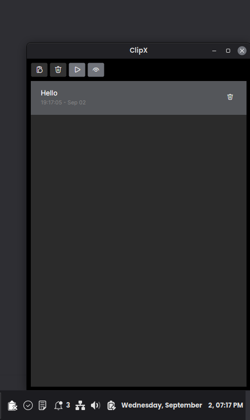
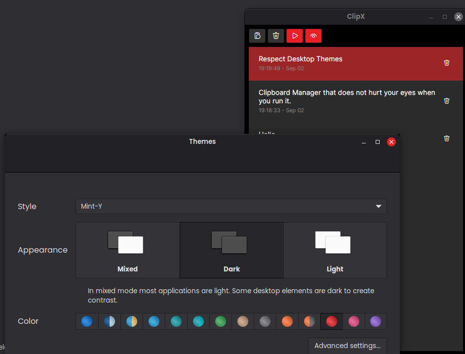
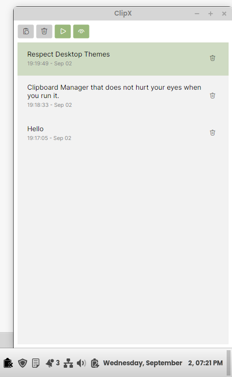
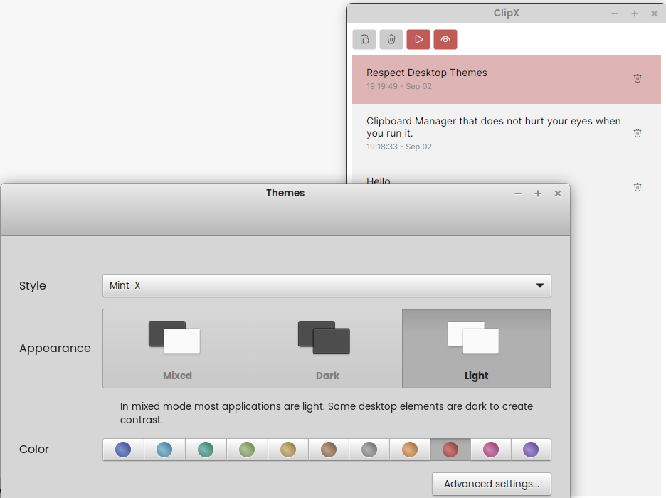

# XClip

XClip is a lightweight desktop clipboard history manager built with **Avalonia UI** and **.NET 10**.
It runs in the system tray, keeps your recent copied text items, and lets you quickly search, re-copy, and paste previous entries back into the app you were using.

## Features

- Monitors clipboard text in near real time
- Maintains clipboard history (newest items on top)
- Re-copy an item by selecting it
- Global hotkey to show/hide the window from anywhere (default: `Alt + Shift + K`)
- Fuzzy search to quickly find items in the clipboard list
- Press `Enter` to copy the selected item and paste it into the previously active window
- Type `1-99` to quickly pick a visible clipboard item
- Delete individual entries or clear full history
- Clear current system clipboard
- Toggle clipboard monitoring on/off
- Toggle app auto-start on login (Windows/Linux/macOS support in code)
- Minimize-to-tray behavior with tray menu actions
- Light/dark tray and window icon switching based on theme

## Screenshots

### Main window



### Theme variants





## Tech Stack

- .NET `net10.0`
- Avalonia UI `12.1.1`
- CommunityToolkit.Mvvm
- FluentIcons.Avalonia
- FuzzySharp
- SharpHook

## Prerequisites

- .NET 10 SDK installed
- Linux, Windows, or macOS desktop environment

## Run Locally

From the repository root:

```bash
cd ClipX
dotnet restore
dotnet run
```

## Build (Release)

```bash
cd ClipX
dotnet publish -c Release -f net10.0
```

Published output is placed under `ClipX/bin/Release/net10.0/` (plus runtime-specific folders if you publish with `-r`).

## Keyboard Shortcuts

- `Alt + Shift + K` - Show or hide the XClip window globally
- `Ctrl + S` - Focus the search box
- `Enter` - Copy the selected item and paste it into the previously active window
- `Escape` - Hide the window to tray
- `1-99` - Quickly choose one of the visible clipboard entries

## Project Structure

- `XClip/` - Avalonia desktop app source
- `XClip/ViewModels/` - MVVM view models and clipboard logic
- `XClip/Views/` - UI views (`MainWindow`)
- `XClip/Assets/` - app and tray icons
- `Docs/` - screenshots and documentation images

## Notes

- Clipboard tracking currently focuses on text items.
- Search uses fuzzy matching, so partial or approximate queries can still find relevant clipboard entries.
- The global hotkey can be changed from the Settings window.
- Closing the window hides the app to tray; use tray **Exit** to fully quit.

